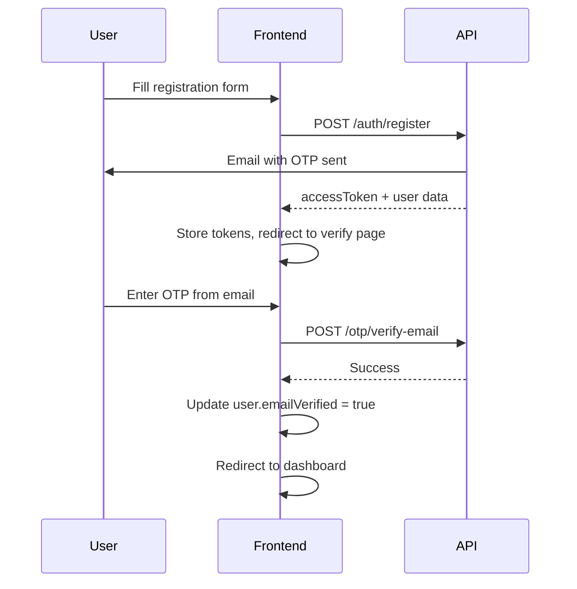
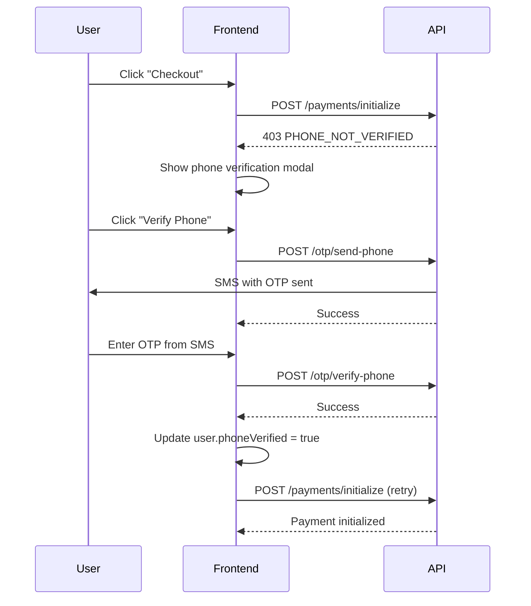
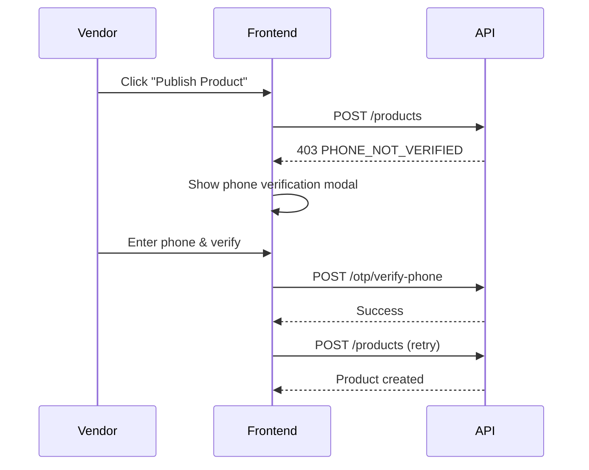

# Frontend Integration Guide

Complete guide for integrating the frontend with the marketplace API's OTP verification system.

## 📋 Table of Contents

1. [API Endpoints Overview](#api-endpoints-overview)
2. [User Flows](#user-flows)
3. [React/Next.js Examples](#reactnextjs-examples)
4. [State Management](#state-management)
5. [Error Handling](#error-handling)
6. [UI Components](#ui-components)

---

## 🔌 API Endpoints Overview

### Base URL
```
Development: http://localhost:4000
Production: https://your-api-domain.com
```

### Authentication Endpoints

#### 1. Register
```http
POST /auth/register
Content-Type: application/json

{
  "email": "user@example.com",
  "password": "password123",
  "firstName": "John",
  "lastName": "Doe",
  "phone": "0241234567",  // Optional at registration
  "role": "CUSTOMER"      // CUSTOMER, VENDOR, ADMIN
}

Response (201):
{
  "accessToken": "eyJhbGciOiJIUzI1NiIsInR...",
  "refreshToken": "eyJhbGciOiJIUzI1NiIsInR...",
  "user": {
    "id": "clx123...",
    "email": "user@example.com",
    "firstName": "John",
    "lastName": "Doe",
    "phone": "0241234567",
    "emailVerified": false,
    "phoneVerified": false,
    "emailVerifiedAt": null,
    "phoneVerifiedAt": null,
    "role": "CUSTOMER",
    "storeId": null,
    "createdAt": "2025-01-20T00:00:00.000Z",
    "updatedAt": null
  },
  "message": "Registration successful. Please check your email for verification code.",
  "emailVerificationSent": true
}
```

#### 2. Login
```http
POST /auth/login
Content-Type: application/json

{
  "email": "user@example.com",
  "password": "password123"
}

Response (200):
{
  "accessToken": "eyJhbGciOiJIUzI1NiIsInR...",
  "refreshToken": "eyJhbGciOiJIUzI1NiIsInR...",
  "user": {
    "id": "clx123...",
    "email": "user@example.com",
    "emailVerified": true,    // Check this!
    "phoneVerified": false,   // Check this!
    ...
  }
}
```

#### 3. Get Current User
```http
GET /auth/me
Authorization: Bearer {accessToken}

Response (200):
{
  "user": {
    "id": "clx123...",
    "email": "user@example.com",
    "emailVerified": true,
    "phoneVerified": false,
    "emailVerifiedAt": "2025-01-20T01:00:00.000Z",
    "phoneVerifiedAt": null,
    ...
  }
}
```

#### 4. Refresh Token
```http
POST /auth/refresh
Content-Type: application/json

{
  "refreshToken": "eyJhbGciOiJIUzI1NiIsInR..."
}

Response (200):
{
  "accessToken": "eyJhbGciOiJIUzI1NiIsInR...",
  "refreshToken": "eyJhbGciOiJIUzI1NiIsInR...",
  "user": { ... }
}
```

### OTP Endpoints

#### 5. Send Email OTP
```http
POST /otp/send-email
Content-Type: application/json
Authorization: Bearer {accessToken}  // Optional

{
  "email": "user@example.com",
  "purpose": "REGISTRATION"  // REGISTRATION, PASSWORD_RESET
}

Response (200):
{
  "success": true,
  "message": "Verification code sent to your email",
  "expiresIn": 15  // minutes
}

Error (400):
{
  "message": "Too many requests. Please try again in 10 minutes."
}
```

#### 6. Verify Email OTP
```http
POST /otp/verify-email
Content-Type: application/json

{
  "email": "user@example.com",
  "code": "123456",
  "purpose": "REGISTRATION"
}

Response (200):
{
  "success": true,
  "message": "Verification successful"
}

Error (400):
{
  "message": "Invalid verification code. 2 attempt(s) remaining."
}
```

#### 7. Resend Email OTP
```http
POST /otp/resend-email
Content-Type: application/json

{
  "email": "user@example.com",
  "purpose": "REGISTRATION"
}

Response (200):
{
  "success": true,
  "message": "Verification code sent to your email",
  "expiresIn": 15
}

Error (429):
{
  "message": "Too many requests. Please try again in 10 minutes."
}
```

#### 8. Send Phone OTP
```http
POST /otp/send-phone
Content-Type: application/json
Authorization: Bearer {accessToken}  // REQUIRED

{
  "phone": "0241234567",
  "purpose": "PHONE_VERIFICATION"
}

Response (200):
{
  "success": true,
  "message": "Verification code sent to your phone",
  "expiresIn": 5  // minutes
}

Error (400):
{
  "message": "Invalid phone number format. Please use a valid Ghana number."
}
```

#### 9. Verify Phone OTP
```http
POST /otp/verify-phone
Content-Type: application/json
Authorization: Bearer {accessToken}  // REQUIRED

{
  "phone": "0241234567",
  "code": "123456",
  "purpose": "PHONE_VERIFICATION"
}

Response (200):
{
  "success": true,
  "message": "Verification successful"
}
```

#### 10. Resend Phone OTP
```http
POST /otp/resend-phone
Content-Type: application/json
Authorization: Bearer {accessToken}  // REQUIRED

{
  "phone": "0241234567",
  "purpose": "PHONE_VERIFICATION"
}
```

### Verification Gate Errors

When phone verification is required but not completed:

```http
POST /payments/initialize
Authorization: Bearer {accessToken}

Response (403):
{
  "message": "Phone verification required",
  "code": "PHONE_NOT_VERIFIED",
  "action": "Please verify your phone number to continue",
  "phone": "0241234567"  // User's phone number
}
```

---

## 🎯 User Flows

### Flow 1: Registration & Email Verification



### Flow 2: Phone Verification (Before Checkout)



### Flow 3: Phone Verification (Before Publishing Product)



---

## ⚛️ React/Next.js Examples

### Setup API Client

```typescript
// lib/api.ts
import axios from 'axios';

const api = axios.create({
  baseURL: process.env.NEXT_PUBLIC_API_URL || 'http://localhost:4000',
  headers: {
    'Content-Type': 'application/json',
  },
});

// Request interceptor - add auth token
api.interceptors.request.use((config) => {
  const token = localStorage.getItem('accessToken');
  if (token) {
    config.headers.Authorization = `Bearer ${token}`;
  }
  return config;
});

// Response interceptor - handle token refresh
api.interceptors.response.use(
  (response) => response,
  async (error) => {
    const originalRequest = error.config;

    if (error.response?.status === 401 && !originalRequest._retry) {
      originalRequest._retry = true;

      try {
        const refreshToken = localStorage.getItem('refreshToken');
        const { data } = await axios.post(
          `${process.env.NEXT_PUBLIC_API_URL}/auth/refresh`,
          { refreshToken }
        );

        localStorage.setItem('accessToken', data.accessToken);
        localStorage.setItem('refreshToken', data.refreshToken);

        originalRequest.headers.Authorization = `Bearer ${data.accessToken}`;
        return api(originalRequest);
      } catch (refreshError) {
        // Refresh failed - redirect to login
        localStorage.removeItem('accessToken');
        localStorage.removeItem('refreshToken');
        window.location.href = '/login';
        return Promise.reject(refreshError);
      }
    }

    return Promise.reject(error);
  }
);

export default api;
```

### Auth Service

```typescript
// services/auth.service.ts
import api from '@/lib/api';

export interface User {
  id: string;
  email: string;
  firstName: string | null;
  lastName: string | null;
  phone: string | null;
  emailVerified: boolean;
  phoneVerified: boolean;
  emailVerifiedAt: string | null;
  phoneVerifiedAt: string | null;
  role: 'CUSTOMER' | 'VENDOR' | 'ADMIN';
  storeId: string | null;
  createdAt: string;
  updatedAt: string | null;
}

export interface AuthResponse {
  accessToken: string;
  refreshToken: string;
  user: User;
  message?: string;
  emailVerificationSent?: boolean;
}

export const authService = {
  async register(data: {
    email: string;
    password: string;
    firstName: string;
    lastName: string;
    phone?: string;
    role?: 'CUSTOMER' | 'VENDOR';
  }): Promise<AuthResponse> {
    const response = await api.post<AuthResponse>('/auth/register', {
      ...data,
      role: data.role || 'CUSTOMER',
    });
    return response.data;
  },

  async login(email: string, password: string): Promise<AuthResponse> {
    const response = await api.post<AuthResponse>('/auth/login', {
      email,
      password,
    });
    return response.data;
  },

  async getMe(): Promise<User> {
    const response = await api.get<{ user: User }>('/auth/me');
    return response.data.user;
  },

  async updateProfile(data: {
    firstName?: string;
    lastName?: string;
    phone?: string;
  }): Promise<User> {
    const response = await api.put<{ user: User }>('/auth/me', data);
    return response.data.user;
  },

  async refresh(refreshToken: string): Promise<AuthResponse> {
    const response = await api.post<AuthResponse>('/auth/refresh', {
      refreshToken,
    });
    return response.data;
  },
};
```

### OTP Service

```typescript
// services/otp.service.ts
import api from '@/lib/api';

export interface OtpResponse {
  success: boolean;
  message: string;
  expiresIn?: number;
}

export type OtpPurpose = 'REGISTRATION' | 'PHONE_VERIFICATION' | 'PASSWORD_RESET';

export const otpService = {
  async sendEmailOtp(email: string, purpose: OtpPurpose = 'REGISTRATION'): Promise<OtpResponse> {
    const response = await api.post<OtpResponse>('/otp/send-email', {
      email,
      purpose,
    });
    return response.data;
  },

  async verifyEmailOtp(
    email: string,
    code: string,
    purpose: OtpPurpose = 'REGISTRATION'
  ): Promise<OtpResponse> {
    const response = await api.post<OtpResponse>('/otp/verify-email', {
      email,
      code,
      purpose,
    });
    return response.data;
  },

  async resendEmailOtp(email: string, purpose: OtpPurpose = 'REGISTRATION'): Promise<OtpResponse> {
    const response = await api.post<OtpResponse>('/otp/resend-email', {
      email,
      purpose,
    });
    return response.data;
  },

  async sendPhoneOtp(phone: string, purpose: OtpPurpose = 'PHONE_VERIFICATION'): Promise<OtpResponse> {
    const response = await api.post<OtpResponse>('/otp/send-phone', {
      phone,
      purpose,
    });
    return response.data;
  },

  async verifyPhoneOtp(
    phone: string,
    code: string,
    purpose: OtpPurpose = 'PHONE_VERIFICATION'
  ): Promise<OtpResponse> {
    const response = await api.post<OtpResponse>('/otp/verify-phone', {
      phone,
      code,
      purpose,
    });
    return response.data;
  },

  async resendPhoneOtp(phone: string, purpose: OtpPurpose = 'PHONE_VERIFICATION'): Promise<OtpResponse> {
    const response = await api.post<OtpResponse>('/otp/resend-phone', {
      phone,
      purpose,
    });
    return response.data;
  },
};
```

### Registration Page

```tsx
// app/register/page.tsx
'use client';

import { useState } from 'react';
import { useRouter } from 'next/navigation';
import { authService } from '@/services/auth.service';

export default function RegisterPage() {
  const router = useRouter();
  const [formData, setFormData] = useState({
    email: '',
    password: '',
    firstName: '',
    lastName: '',
    phone: '',
    role: 'CUSTOMER' as 'CUSTOMER' | 'VENDOR',
  });
  const [loading, setLoading] = useState(false);
  const [error, setError] = useState('');

  const handleSubmit = async (e: React.FormEvent) => {
    e.preventDefault();
    setLoading(true);
    setError('');

    try {
      const response = await authService.register(formData);

      // Store tokens
      localStorage.setItem('accessToken', response.accessToken);
      localStorage.setItem('refreshToken', response.refreshToken);
      localStorage.setItem('user', JSON.stringify(response.user));

      // Redirect to email verification
      router.push(`/verify-email?email=${encodeURIComponent(formData.email)}`);
    } catch (err: any) {
      setError(err.response?.data?.message || 'Registration failed');
    } finally {
      setLoading(false);
    }
  };

  return (
    <div className="max-w-md mx-auto p-6">
      <h1 className="text-2xl font-bold mb-6">Create Account</h1>

      {error && (
        <div className="bg-red-50 border border-red-200 text-red-700 px-4 py-3 rounded mb-4">
          {error}
        </div>
      )}

      <form onSubmit={handleSubmit} className="space-y-4">
        <div>
          <label className="block text-sm font-medium mb-1">Email</label>
          <input
            type="email"
            required
            value={formData.email}
            onChange={(e) => setFormData({ ...formData, email: e.target.value })}
            className="w-full px-3 py-2 border rounded-lg"
          />
        </div>

        <div>
          <label className="block text-sm font-medium mb-1">Password</label>
          <input
            type="password"
            required
            minLength={8}
            value={formData.password}
            onChange={(e) => setFormData({ ...formData, password: e.target.value })}
            className="w-full px-3 py-2 border rounded-lg"
          />
        </div>

        <div className="grid grid-cols-2 gap-4">
          <div>
            <label className="block text-sm font-medium mb-1">First Name</label>
            <input
              type="text"
              required
              value={formData.firstName}
              onChange={(e) => setFormData({ ...formData, firstName: e.target.value })}
              className="w-full px-3 py-2 border rounded-lg"
            />
          </div>

          <div>
            <label className="block text-sm font-medium mb-1">Last Name</label>
            <input
              type="text"
              required
              value={formData.lastName}
              onChange={(e) => setFormData({ ...formData, lastName: e.target.value })}
              className="w-full px-3 py-2 border rounded-lg"
            />
          </div>
        </div>

        <div>
          <label className="block text-sm font-medium mb-1">Phone (Optional)</label>
          <input
            type="tel"
            placeholder="0241234567"
            value={formData.phone}
            onChange={(e) => setFormData({ ...formData, phone: e.target.value })}
            className="w-full px-3 py-2 border rounded-lg"
          />
          <p className="text-sm text-gray-500 mt-1">
            You can verify later before making purchases
          </p>
        </div>

        <div>
          <label className="block text-sm font-medium mb-1">Account Type</label>
          <select
            value={formData.role}
            onChange={(e) => setFormData({ ...formData, role: e.target.value as any })}
            className="w-full px-3 py-2 border rounded-lg"
          >
            <option value="CUSTOMER">Customer (Buy products)</option>
            <option value="VENDOR">Vendor (Sell products)</option>
          </select>
        </div>

        <button
          type="submit"
          disabled={loading}
          className="w-full bg-blue-600 text-white py-2 px-4 rounded-lg hover:bg-blue-700 disabled:opacity-50"
        >
          {loading ? 'Creating Account...' : 'Create Account'}
        </button>
      </form>
    </div>
  );
}
```

### Email Verification Page

```tsx
// app/verify-email/page.tsx
'use client';

import { useState, useEffect } from 'react';
import { useRouter, useSearchParams } from 'next/navigation';
import { otpService } from '@/services/otp.service';

export default function VerifyEmailPage() {
  const router = useRouter();
  const searchParams = useSearchParams();
  const email = searchParams.get('email') || '';

  const [code, setCode] = useState(['', '', '', '', '', '']);
  const [loading, setLoading] = useState(false);
  const [error, setError] = useState('');
  const [resending, setResending] = useState(false);
  const [countdown, setCountdown] = useState(0);

  useEffect(() => {
    if (countdown > 0) {
      const timer = setTimeout(() => setCountdown(countdown - 1), 1000);
      return () => clearTimeout(timer);
    }
  }, [countdown]);

  const handleCodeChange = (index: number, value: string) => {
    if (value.length > 1) return; // Only allow single digit

    const newCode = [...code];
    newCode[index] = value;
    setCode(newCode);

    // Auto-focus next input
    if (value && index < 5) {
      const nextInput = document.getElementById(`code-${index + 1}`);
      nextInput?.focus();
    }

    // Auto-submit when all 6 digits entered
    if (index === 5 && value && newCode.every((digit) => digit)) {
      handleVerify(newCode.join(''));
    }
  };

  const handleVerify = async (otpCode?: string) => {
    const verificationCode = otpCode || code.join('');
    if (verificationCode.length !== 6) return;

    setLoading(true);
    setError('');

    try {
      await otpService.verifyEmailOtp(email, verificationCode);

      // Update user in localStorage
      const user = JSON.parse(localStorage.getItem('user') || '{}');
      user.emailVerified = true;
      localStorage.setItem('user', JSON.stringify(user));

      // Redirect to dashboard
      router.push('/dashboard');
    } catch (err: any) {
      setError(err.response?.data?.message || 'Verification failed');
      setCode(['', '', '', '', '', '']);
      document.getElementById('code-0')?.focus();
    } finally {
      setLoading(false);
    }
  };

  const handleResend = async () => {
    setResending(true);
    setError('');

    try {
      await otpService.resendEmailOtp(email);
      setCountdown(60); // 60 second countdown
    } catch (err: any) {
      setError(err.response?.data?.message || 'Failed to resend code');
    } finally {
      setResending(false);
    }
  };

  return (
    <div className="max-w-md mx-auto p-6">
      <h1 className="text-2xl font-bold mb-2">Verify Your Email</h1>
      <p className="text-gray-600 mb-6">
        We sent a 6-digit code to <strong>{email}</strong>
      </p>

      {error && (
        <div className="bg-red-50 border border-red-200 text-red-700 px-4 py-3 rounded mb-4">
          {error}
        </div>
      )}

      <div className="flex gap-2 justify-center mb-6">
        {code.map((digit, index) => (
          <input
            key={index}
            id={`code-${index}`}
            type="text"
            inputMode="numeric"
            maxLength={1}
            value={digit}
            onChange={(e) => handleCodeChange(index, e.target.value)}
            onKeyDown={(e) => {
              if (e.key === 'Backspace' && !digit && index > 0) {
                document.getElementById(`code-${index - 1}`)?.focus();
              }
            }}
            className="w-12 h-12 text-center text-2xl border-2 rounded-lg focus:border-blue-500"
            disabled={loading}
          />
        ))}
      </div>

      <div className="text-center mb-4">
        {countdown > 0 ? (
          <p className="text-gray-500">Resend code in {countdown}s</p>
        ) : (
          <button
            onClick={handleResend}
            disabled={resending}
            className="text-blue-600 hover:underline disabled:opacity-50"
          >
            {resending ? 'Sending...' : "Didn't receive code? Resend"}
          </button>
        )}
      </div>

      <button
        onClick={() => handleVerify()}
        disabled={loading || code.some((digit) => !digit)}
        className="w-full bg-blue-600 text-white py-2 px-4 rounded-lg hover:bg-blue-700 disabled:opacity-50"
      >
        {loading ? 'Verifying...' : 'Verify Email'}
      </button>
    </div>
  );
}
```

### Phone Verification Modal

```tsx
// components/PhoneVerificationModal.tsx
'use client';

import { useState, useEffect } from 'react';
import { otpService } from '@/services/otp.service';
import { authService } from '@/services/auth.service';

interface PhoneVerificationModalProps {
  isOpen: boolean;
  onClose: () => void;
  onSuccess: () => void;
  userPhone?: string;
}

export default function PhoneVerificationModal({
  isOpen,
  onClose,
  onSuccess,
  userPhone = '',
}: PhoneVerificationModalProps) {
  const [step, setStep] = useState<'phone' | 'code'>('phone');
  const [phone, setPhone] = useState(userPhone);
  const [code, setCode] = useState(['', '', '', '', '', '']);
  const [loading, setLoading] = useState(false);
  const [error, setError] = useState('');
  const [countdown, setCountdown] = useState(0);

  useEffect(() => {
    if (isOpen && userPhone) {
      // If user has phone, skip to code entry
      setPhone(userPhone);
      handleSendOtp(userPhone);
    } else if (isOpen) {
      setStep('phone');
    }
  }, [isOpen, userPhone]);

  useEffect(() => {
    if (countdown > 0) {
      const timer = setTimeout(() => setCountdown(countdown - 1), 1000);
      return () => clearTimeout(timer);
    }
  }, [countdown]);

  const handleSendOtp = async (phoneNumber?: string) => {
    const phoneToUse = phoneNumber || phone;
    if (!phoneToUse) return;

    setLoading(true);
    setError('');

    try {
      await otpService.sendPhoneOtp(phoneToUse);
      setStep('code');
      setCountdown(60);
    } catch (err: any) {
      setError(err.response?.data?.message || 'Failed to send code');
    } finally {
      setLoading(false);
    }
  };

  const handleCodeChange = (index: number, value: string) => {
    if (value.length > 1) return;

    const newCode = [...code];
    newCode[index] = value;
    setCode(newCode);

    if (value && index < 5) {
      document.getElementById(`phone-code-${index + 1}`)?.focus();
    }

    if (index === 5 && value && newCode.every((digit) => digit)) {
      handleVerify(newCode.join(''));
    }
  };

  const handleVerify = async (otpCode?: string) => {
    const verificationCode = otpCode || code.join('');
    if (verificationCode.length !== 6) return;

    setLoading(true);
    setError('');

    try {
      await otpService.verifyPhoneOtp(phone, verificationCode);

      // Update user in localStorage
      const updatedUser = await authService.getMe();
      localStorage.setItem('user', JSON.stringify(updatedUser));

      onSuccess();
      onClose();
    } catch (err: any) {
      setError(err.response?.data?.message || 'Verification failed');
      setCode(['', '', '', '', '', '']);
    } finally {
      setLoading(false);
    }
  };

  if (!isOpen) return null;

  return (
    <div className="fixed inset-0 bg-black bg-opacity-50 flex items-center justify-center z-50">
      <div className="bg-white rounded-lg p-6 max-w-md w-full mx-4">
        <h2 className="text-xl font-bold mb-4">Verify Phone Number</h2>

        {error && (
          <div className="bg-red-50 border border-red-200 text-red-700 px-4 py-3 rounded mb-4">
            {error}
          </div>
        )}

        {step === 'phone' ? (
          <>
            <p className="text-gray-600 mb-4">
              Phone verification is required before you can proceed with this action.
            </p>

            <div className="mb-4">
              <label className="block text-sm font-medium mb-1">Phone Number</label>
              <input
                type="tel"
                placeholder="0241234567"
                value={phone}
                onChange={(e) => setPhone(e.target.value)}
                className="w-full px-3 py-2 border rounded-lg"
              />
              <p className="text-sm text-gray-500 mt-1">Ghana number format</p>
            </div>

            <div className="flex gap-2">
              <button
                onClick={onClose}
                className="flex-1 px-4 py-2 border rounded-lg hover:bg-gray-50"
              >
                Cancel
              </button>
              <button
                onClick={() => handleSendOtp()}
                disabled={!phone || loading}
                className="flex-1 bg-blue-600 text-white py-2 px-4 rounded-lg hover:bg-blue-700 disabled:opacity-50"
              >
                {loading ? 'Sending...' : 'Send Code'}
              </button>
            </div>
          </>
        ) : (
          <>
            <p className="text-gray-600 mb-4">
              We sent a 6-digit code to <strong>{phone}</strong>
            </p>

            <div className="flex gap-2 justify-center mb-4">
              {code.map((digit, index) => (
                <input
                  key={index}
                  id={`phone-code-${index}`}
                  type="text"
                  inputMode="numeric"
                  maxLength={1}
                  value={digit}
                  onChange={(e) => handleCodeChange(index, e.target.value)}
                  onKeyDown={(e) => {
                    if (e.key === 'Backspace' && !digit && index > 0) {
                      document.getElementById(`phone-code-${index - 1}`)?.focus();
                    }
                  }}
                  className="w-12 h-12 text-center text-2xl border-2 rounded-lg focus:border-blue-500"
                  disabled={loading}
                />
              ))}
            </div>

            <div className="text-center mb-4">
              {countdown > 0 ? (
                <p className="text-gray-500">Resend code in {countdown}s</p>
              ) : (
                <button
                  onClick={() => handleSendOtp()}
                  disabled={loading}
                  className="text-blue-600 hover:underline disabled:opacity-50"
                >
                  Resend Code
                </button>
              )}
            </div>

            <div className="flex gap-2">
              <button
                onClick={() => {
                  setStep('phone');
                  setCode(['', '', '', '', '', '']);
                }}
                className="flex-1 px-4 py-2 border rounded-lg hover:bg-gray-50"
              >
                Back
              </button>
              <button
                onClick={() => handleVerify()}
                disabled={loading || code.some((digit) => !digit)}
                className="flex-1 bg-blue-600 text-white py-2 px-4 rounded-lg hover:bg-blue-700 disabled:opacity-50"
              >
                {loading ? 'Verifying...' : 'Verify'}
              </button>
            </div>
          </>
        )}
      </div>
    </div>
  );
}
```

### Checkout with Phone Verification

```tsx
// app/checkout/page.tsx
'use client';

import { useState, useEffect } from 'react';
import PhoneVerificationModal from '@/components/PhoneVerificationModal';
import api from '@/lib/api';

export default function CheckoutPage() {
  const [user, setUser] = useState<any>(null);
  const [showPhoneModal, setShowPhoneModal] = useState(false);
  const [loading, setLoading] = useState(false);

  useEffect(() => {
    const userData = localStorage.getItem('user');
    if (userData) {
      setUser(JSON.parse(userData));
    }
  }, []);

  const handleCheckout = async () => {
    // Check if phone is verified
    if (!user?.phoneVerified) {
      setShowPhoneModal(true);
      return;
    }

    setLoading(true);

    try {
      // Proceed with payment initialization
      const response = await api.post('/payments/initialize', {
        orderId: 'order_123',
        email: user.email,
        amount: 10000, // Amount in pesewas (GHS 100.00)
      });

      // Redirect to payment page
      window.location.href = response.data.authorization_url;
    } catch (err: any) {
      if (err.response?.data?.code === 'PHONE_NOT_VERIFIED') {
        setShowPhoneModal(true);
      } else {
        alert(err.response?.data?.message || 'Payment initialization failed');
      }
    } finally {
      setLoading(false);
    }
  };

  const handlePhoneVerified = () => {
    // Update user state
    const userData = localStorage.getItem('user');
    if (userData) {
      setUser(JSON.parse(userData));
    }
    // Retry checkout automatically
    handleCheckout();
  };

  return (
    <div className="max-w-2xl mx-auto p-6">
      <h1 className="text-2xl font-bold mb-6">Checkout</h1>

      {/* Cart items here */}

      <button
        onClick={handleCheckout}
        disabled={loading}
        className="w-full bg-green-600 text-white py-3 px-4 rounded-lg hover:bg-green-700 disabled:opacity-50"
      >
        {loading ? 'Processing...' : 'Proceed to Payment'}
      </button>

      <PhoneVerificationModal
        isOpen={showPhoneModal}
        onClose={() => setShowPhoneModal(false)}
        onSuccess={handlePhoneVerified}
        userPhone={user?.phone}
      />
    </div>
  );
}
```

---

## 🏗️ State Management

### Using React Context

```typescript
// context/AuthContext.tsx
'use client';

import { createContext, useContext, useState, useEffect, ReactNode } from 'react';
import { authService, User } from '@/services/auth.service';

interface AuthContextType {
  user: User | null;
  loading: boolean;
  login: (email: string, password: string) => Promise<void>;
  logout: () => void;
  refreshUser: () => Promise<void>;
  isEmailVerified: boolean;
  isPhoneVerified: boolean;
}

const AuthContext = createContext<AuthContextType | undefined>(undefined);

export function AuthProvider({ children }: { children: ReactNode }) {
  const [user, setUser] = useState<User | null>(null);
  const [loading, setLoading] = useState(true);

  useEffect(() => {
    // Load user from localStorage on mount
    const userData = localStorage.getItem('user');
    if (userData) {
      setUser(JSON.parse(userData));
    }
    setLoading(false);
  }, []);

  const login = async (email: string, password: string) => {
    const response = await authService.login(email, password);
    localStorage.setItem('accessToken', response.accessToken);
    localStorage.setItem('refreshToken', response.refreshToken);
    localStorage.setItem('user', JSON.stringify(response.user));
    setUser(response.user);
  };

  const logout = () => {
    localStorage.removeItem('accessToken');
    localStorage.removeItem('refreshToken');
    localStorage.removeItem('user');
    setUser(null);
  };

  const refreshUser = async () => {
    const updatedUser = await authService.getMe();
    localStorage.setItem('user', JSON.stringify(updatedUser));
    setUser(updatedUser);
  };

  return (
    <AuthContext.Provider
      value={{
        user,
        loading,
        login,
        logout,
        refreshUser,
        isEmailVerified: user?.emailVerified || false,
        isPhoneVerified: user?.phoneVerified || false,
      }}
    >
      {children}
    </AuthContext.Provider>
  );
}

export const useAuth = () => {
  const context = useContext(AuthContext);
  if (!context) {
    throw new Error('useAuth must be used within AuthProvider');
  }
  return context;
};
```

### Using the Context

```tsx
// app/dashboard/page.tsx
'use client';

import { useAuth } from '@/context/AuthContext';
import { useRouter } from 'next/navigation';

export default function DashboardPage() {
  const { user, isEmailVerified, isPhoneVerified } = useAuth();
  const router = useRouter();

  if (!user) {
    router.push('/login');
    return null;
  }

  return (
    <div className="max-w-4xl mx-auto p-6">
      <h1 className="text-2xl font-bold mb-6">Dashboard</h1>

      <div className="space-y-4">
        {/* Email verification status */}
        {!isEmailVerified && (
          <div className="bg-yellow-50 border border-yellow-200 p-4 rounded-lg">
            <p className="font-medium">Email not verified</p>
            <p className="text-sm text-gray-600 mb-2">
              Please verify your email to access all features
            </p>
            <button
              onClick={() => router.push(`/verify-email?email=${user.email}`)}
              className="text-blue-600 hover:underline"
            >
              Verify Now
            </button>
          </div>
        )}

        {/* Phone verification status */}
        {!isPhoneVerified && (
          <div className="bg-blue-50 border border-blue-200 p-4 rounded-lg">
            <p className="font-medium">Phone not verified</p>
            <p className="text-sm text-gray-600">
              Verify your phone number to make purchases and publish listings
            </p>
          </div>
        )}

        {/* Dashboard content */}
        <div className="bg-white border rounded-lg p-6">
          <h2 className="text-xl font-semibold mb-4">Welcome, {user.firstName}!</h2>
          {/* Rest of dashboard */}
        </div>
      </div>
    </div>
  );
}
```

---

## ⚠️ Error Handling

### Common Error Codes

```typescript
// utils/errors.ts
export const API_ERROR_CODES = {
  // Verification errors
  EMAIL_NOT_VERIFIED: 'EMAIL_NOT_VERIFIED',
  PHONE_NOT_VERIFIED: 'PHONE_NOT_VERIFIED',
  PHONE_NOT_SET: 'PHONE_NOT_SET',
  FULL_VERIFICATION_REQUIRED: 'FULL_VERIFICATION_REQUIRED',

  // OTP errors
  INVALID_OTP: 'Invalid verification code',
  EXPIRED_OTP: 'Invalid or expired verification code',
  TOO_MANY_ATTEMPTS: 'Too many failed attempts',
  RATE_LIMITED: 'Too many requests. Please try again',
};

export function handleApiError(error: any): string {
  if (error.response?.data?.code) {
    return error.response.data.message;
  }

  if (error.response?.data?.message) {
    return error.response.data.message;
  }

  return 'An unexpected error occurred. Please try again.';
}
```

### Error Handler Component

```tsx
// components/ErrorAlert.tsx
interface ErrorAlertProps {
  error: string | null;
  onClose?: () => void;
}

export default function ErrorAlert({ error, onClose }: ErrorAlertProps) {
  if (!error) return null;

  return (
    <div className="bg-red-50 border border-red-200 text-red-700 px-4 py-3 rounded mb-4 flex items-center justify-between">
      <span>{error}</span>
      {onClose && (
        <button onClick={onClose} className="text-red-700 hover:text-red-900">
          ×
        </button>
      )}
    </div>
  );
}
```

---

## 🎨 UI Components

### Verification Badge

```tsx
// components/VerificationBadge.tsx
interface VerificationBadgeProps {
  verified: boolean;
  label: string;
}

export default function VerificationBadge({ verified, label }: VerificationBadgeProps) {
  return (
    <span
      className={`inline-flex items-center px-2 py-1 rounded-full text-xs font-medium ${
        verified
          ? 'bg-green-100 text-green-800'
          : 'bg-gray-100 text-gray-800'
      }`}
    >
      {verified ? '✓' : '○'} {label}
    </span>
  );
}
```

### Loading Spinner

```tsx
// components/LoadingSpinner.tsx
export default function LoadingSpinner({ size = 'md' }: { size?: 'sm' | 'md' | 'lg' }) {
  const sizeClasses = {
    sm: 'w-4 h-4',
    md: 'w-8 h-8',
    lg: 'w-12 h-12',
  };

  return (
    <div className={`animate-spin rounded-full border-2 border-gray-300 border-t-blue-600 ${sizeClasses[size]}`} />
  );
}
```

---

## 📱 Mobile Considerations

### OTP Input for Mobile

```tsx
// Use inputMode="numeric" for better mobile keyboard
<input
  type="text"
  inputMode="numeric"
  pattern="[0-9]*"
  maxLength={1}
  // ... other props
/>
```

### Auto-fill OTP (iOS/Android)

```tsx
// Enable OTP autofill on mobile devices
<input
  type="text"
  inputMode="numeric"
  autoComplete="one-time-code"
  // ... other props
/>
```

---

## 🔐 Security Best Practices

1. **Never store sensitive data in localStorage**
   - ✅ Access tokens are okay (short-lived)
   - ❌ Don't store passwords or payment info

2. **Implement token refresh**
   - Automatically refresh expired access tokens
   - Redirect to login if refresh fails

3. **Validate on both frontend and backend**
   - Frontend validation for UX
   - Backend validation for security

4. **Use HTTPS in production**
   - Ensure API uses HTTPS
   - Set secure cookie flags

5. **Handle rate limiting gracefully**
   - Show countdown timers
   - Inform users why they're blocked

---

## 📚 Additional Resources

- [API Documentation](http://localhost:4000/docs) - OpenAPI/Swagger docs
- [SETUP.md](../SETUP.md) - Backend setup guide
- [Resend Docs](https://resend.com/docs) - Email service
- [Arkesel Docs](https://developers.arkesel.com) - SMS service

---

## 🆘 Troubleshooting

### Issue: OTP not received

**Email:**
- Check spam/junk folder
- Verify email address is correct
- Check Resend dashboard for delivery status

**SMS:**
- Verify phone number format (Ghana: 0XXXXXXXXX or 233XXXXXXXXX)
- Check Arkesel dashboard for delivery status
- Ensure sandbox mode is disabled in production

### Issue: "Phone verification required" error

This means the user hasn't verified their phone. Show the phone verification modal:

```tsx
if (error.response?.data?.code === 'PHONE_NOT_VERIFIED') {
  setShowPhoneModal(true);
}
```

### Issue: Token expired

Implement token refresh in your API interceptor (see Setup API Client section above).

---

## ✅ Checklist

Frontend integration checklist:

- [ ] API client setup with token refresh
- [ ] Auth service (register, login, getMe)
- [ ] OTP service (send, verify, resend)
- [ ] Registration page with email OTP flow
- [ ] Email verification page
- [ ] Phone verification modal component
- [ ] Checkout page with phone verification gate
- [ ] Product publish with phone verification gate
- [ ] Auth context/state management
- [ ] Error handling
- [ ] Loading states
- [ ] Mobile responsive design
- [ ] OTP autofill for mobile
- [ ] Verification status badges
- [ ] Countdown timers for resend

---

## 🎉 You're Ready!

With this guide, your frontend should be fully integrated with the marketplace API's verification system. Test thoroughly and adjust UI/UX based on user feedback!
